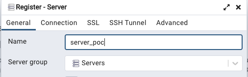
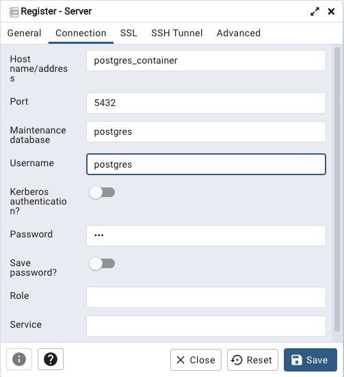

# Install Postgres SQL object-relational database system on Docker

[Postgres for Docker](https://github.com/docker-library/docs/blob/master/postgres/README.md)

This guide aims to deploy a Postgres Database running on Docker with his Admin panel (pgadmin).

For this guide we use a Linux Ubuntu 20.xx and Postgres latest version.

## Quick Install

Connect to your server and clone the repo

```shell
git clone https://gitlab.com/ArnaudSene/postgres-docker.git
cd postgres-docker
```


Edit the `.env` file with required values.

```shell
vi .env
```

```dotenv
POSTGRES_USER=postgres
POSTGRES_PASSWORD="pg password"
POSTGRES_DB="database name"
PGADMIN_DEFAULT_EMAIL="a valid email"
PGADMIN_DEFAULT_PASSWORD="pgadmin password"
```

Create certificate

```shell
mkdir certs
cd certs
openssl req -new -newkey rsa:4096 -x509 -sha256 -days 365 -nodes -out pgadmin_server.crt -keyout pgadmin_server.key
```

Create and start containers.

```shell
bash start-postgres.sh
```


---

## 1. Step by step - Prepare your environment

### 1.1 Docker
`Docker` and `docker compose` must be installed on the server in order to install and start Postgres system. 

- docker installed [Install Docker Engine](https://docs.docker.com/engine/install/)
- docker-compose installed [Install Docker Compose](https://docs.docker.com/compose/install/)

### 1.2 Postgres configuration 
Edit the `.env` file with required values.

```shell
vi .env
```

```dotenv
POSTGRES_USER=postgres
POSTGRES_PASSWORD="pg password"
POSTGRES_DB="database name"
PGADMIN_DEFAULT_EMAIL="a valid email"
PGADMIN_DEFAULT_PASSWORD="pgadmin password"
```

### 1.3 Create a self-signed Certificate (for internal use)

The certificate will be used for Postgres admin panel `pgadmin`

Connect to your linux server and create a crt and key file.

#### 1.3.1 Connect to your linux server

*where server can be for example* 

> - username: vagrant (replace with your username)
> - server  : 192.168.56.38 (replace with your server IP address)

```shell
ssh vagrant@192.168.56.38
```

#### 1.3.2 Create a crt and key file

```shell
cd certs
openssl req -new -newkey rsa:4096 -x509 -sha256 -days 365 -nodes -out pgadmin_server.crt -keyout pgadmin_server.key
```

## 2. Install & start Postgres container
The script will configure the environment, create and start containers.

```shell
bash start-postgres.sh
```

## 3. Connect to pgadmin
### 3.1 Retrieve the pgadmin IP address.

On the server run the following command
```shell
docker inspect postgres-docker-pgadmin-1|grep IPAddress|cut -d":" -f2|tail -1
```

### 3.2 Open the pgadmin web GUI
Through a web browser enter the url to pgadmin with the IP address retrieve before.

> e.g: with IP address = 10.0.0.1
> 
> http://10.0.0.1:5433/

Use the credentials defined in the .env

> PGADMIN_DEFAULT_EMAIL="a valid email"
> 
> PGADMIN_DEFAULT_PASSWORD="pgadmin password"


### 3.3 Add New Server
#### General
> server name: e.g: server_poc



#### Connection
> hostname: postgres_container
>  
> username: postgres
>  
> password: in file `.env` *POSTGRES_PASSWORD*


